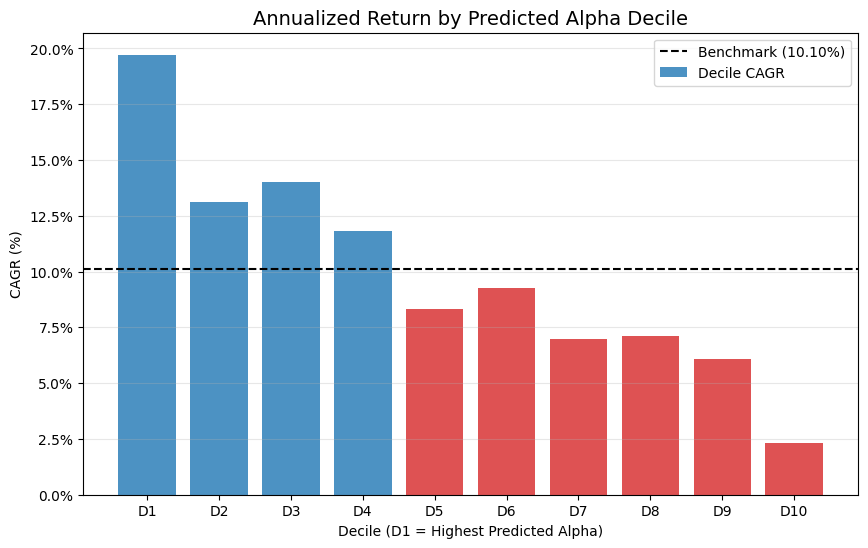

Survivorship bias makes backtests look better. When choosing companies today to test the historical performance of strategies, we will invariably look
better than it should because we avoided companies that went bankrupt. As an example, consider a strategy that buys companies with the lowest P/B ratio. 
If we used the present list of companies in the NYSE, we will have produced a nicer result in backtest than we actually had if we acted with all the
information present at each point in time in the backtest, as by choosing companies that still are here today we avoided companies that went bankrupt. 
To be concrete, let's say of the companies that passed the P/B threshold, 50% doubled in share price but the other 50% went bankrupt. In our naive backtest,
we would have produced a 100% return, but in reality, if we acted at that point in history, we would have produced a 0% return as we also chose the bankrupt
companies. 

To deal with survivorship bias, we only use information that is present at a historical date and act on it. Recreating the S and P 500 is notoriously 
difficult. I used the Refinitiv terminal provided by my university to grab all the additions and removals of the S and P 500. Then, using the current 
S and P 500, I reverse engineered what the S and P would have looked like every year, back to the 1990s. 

Now we can backtest a trading strategy that picks stocks based on fundamentals. To order to prevent lookahead bias, the backtest must only act with 
all the information available at that time. In the United States, the report that details the annual fundamental performance of a company is known
as a 10K report. It is often due 60-90 days after the year ends. Therefore, at the start of April each year, we have in our hands the knowledge of
how the company performed last year. 

Relying on that data, we craft a stock picking strategy that utilises machine learning which has financial metrics as input, and predicts the April-to-April
return of a particular stock. The engineered features were in the spirit of Joseph Piotroski's F Score, which evaluated a company based on profitability, debt,
liquidity, and efficiency. The model was trained on 5 years of data and tested on 1. This process was walked forward, such that years t-1 to t-5 were used to train 
the data, and year t was used as an out of sample test. The chosen algorithm was XGBoost, a state-of-the-art model which captures the nonlinear dyanmics of the
situation. We ranked the average stock performance in each decile of returns predicted by the model. 

## Performance Results

